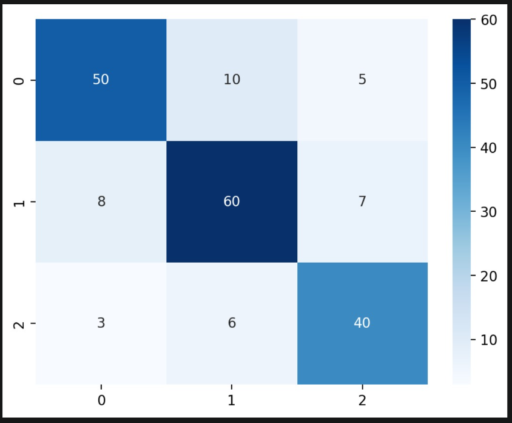
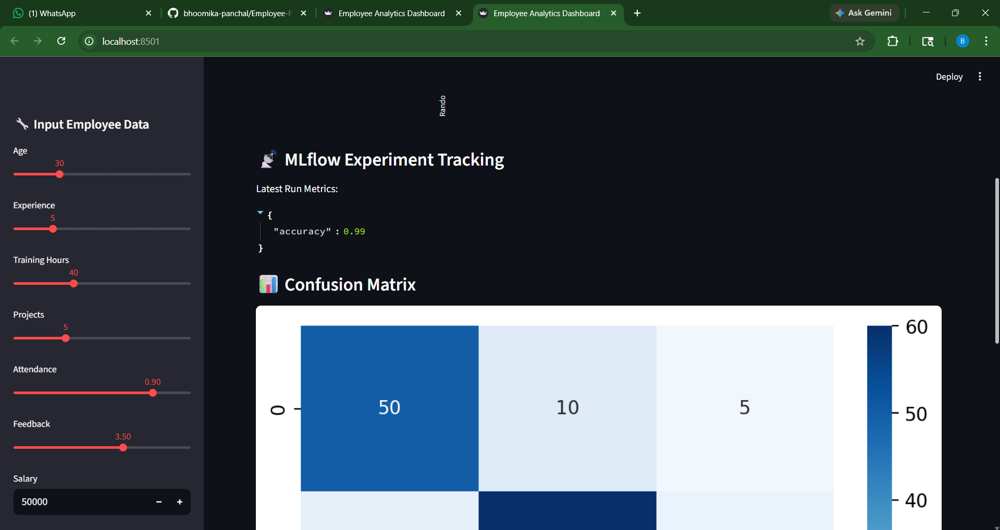
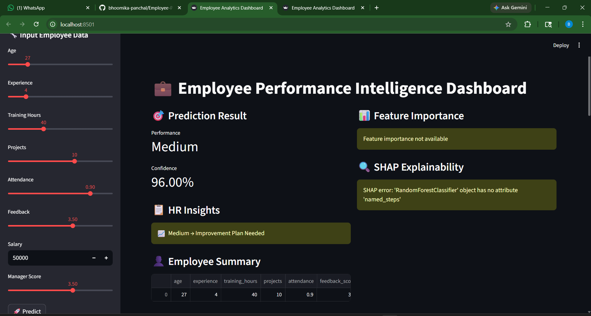

# 👨‍💼 Employee Performance Predictor Using Data Analytics

  
  

  

🚀 An end-to-end Machine Learning project that predicts employee performance and provides actionable HR insights using a production-ready pipeline and interactive dashboard.

---

## 📌 Project Overview

This project simulates a real-world HR analytics system where employee data is used to:

✔ Predict performance (Low / Medium / High)  
✔ Provide intelligent HR recommendations  
✔ Assist in promotion and training decisions  

The system is built using a fully pipeline-based approach to avoid data leakage and ensure scalability.

---

## ⚙️ Key Features

### 🔹 Machine Learning
- RandomForestClassifier with `class_weight='balanced'`
- Stratified Train-Test Split
- End-to-end Pipeline (no manual preprocessing)

### 🔹 Data Processing
- ColumnTransformer
- Numeric:
  - Missing value imputation (median)
  - Feature scaling (StandardScaler)
- Categorical:
  - Missing value handling
  - OneHotEncoding

### 🔹 Model Evaluation
- Accuracy Score
- Classification Report
- Confusion Matrix (heatmap visualization)

### 🔹 HR Insights Engine
- Low → Training & mentoring recommended  
- Medium → Skill improvement plan suggested  
- High → Promotion-ready candidate  

### 🔹 Interactive Dashboard
- Built using Streamlit  
- User inputs employee details  
- Real-time prediction + insights  

---

## 🧠 Tech Stack

| Category | Tools |
|--------|------|
| Language | Python |
| ML | Scikit-learn |
| Visualization | Matplotlib, Seaborn |
| UI | Streamlit |
| Model Storage | Joblib |

---

## 📁 Project Structure
Employee-Performance-Predictor/
│
├── data/
├── src/
│ ├── data_generation.py
│ ├── preprocessing.py
│ ├── model.py
│ ├── insights.py
│
├── app/
│ ├── streamlit_app.py
│
├── models/
├── outputs/
├── requirements.txt
├── main.py
└── README.md

## ▶️ How to Run

1. Install Dependencies
pip install -r requirements.txt

2. Train the Model
python main.py

3. Run Dashboard
streamlit run app/streamlit_app.py

💡 Key Learnings
Built an end-to-end ML pipeline using industry best practices
Prevented data leakage using Pipeline & ColumnTransformer
Designed HR-focused decision system
Integrated ML model with an interactive dashboard